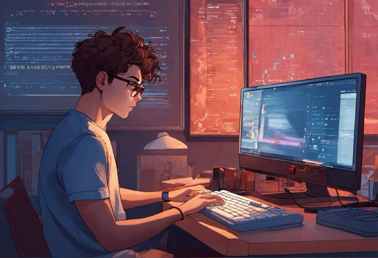
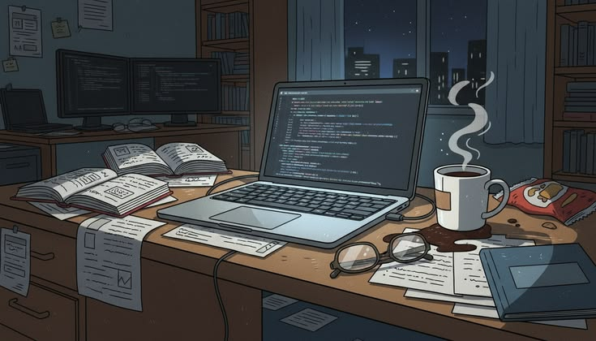

  
  <strong> Hey There! </strong>
  

<h1 align="center">ZAKARIA MUJUR PRASETYO</h1>
<h3 align="center">
  
</h3>

  &nbsp;&nbsp;

 

***

<!-- ENGLISH VERSION -->

<h2 align="center">🇬🇧 &nbsp;English Version</h2>

## 👨🏻‍💻 &nbsp;Who am I?

💡 &nbsp;Hi! I am Zakaria Mujur Prasetyo. I am from Mojokerto and I really enjoy the world of visual storytelling and graphic design.
🎓 &nbsp;Right now I am studying Informatics Engineering at Universitas Trunojoyo Madura. Being here helps me blend my coding skills with creative design seamlessly.
🎨 &nbsp;When it comes to design I focus on making visuals that easily click with the audience.
✨ &nbsp;I am always looking forward to learning new things and trying out fresh design tools.

**Quick Facts:**
* 🌟 Based in Mojokerto
* 📘 Informatics Engineering student at UTM
* 🎨 Enjoy visual design and creative storytelling
* 🚀 Exploring web development and new techs

***

## 📂 &nbsp;My Repositories
> Repositories sorted by **latest commit date** 🕐
* **[ZEDD Zekk External Downloader Drive](https://github.com/ZekkCode/ZEDD-Zekk-External-Downloader-Drive)** &nbsp; *(🌱 Created: 30 Mar 2026 | 🕐 Last commit: 30 Mar 2026)* Cloud video downloader with MVC pattern and Google Drive support

* **[Bank Tugas Project Kuliah](https://github.com/ZekkCode/Bank-TugasProject-Kuliah)** &nbsp; *(🌱 Created: 19 Jan 2025 | 🕐 Last commit: 04 Jan 2026)* Collection of my college assignments at UTM for learning purposes

* **[Trevio Project](https://github.com/ZekkCode/trevio-project)** &nbsp; *(🌱 Created: 06 Dec 2025 | 🕐 Last commit: 16 Dec 2025)* Travel agency app built with Laravel based on Trevio

* **[ZekkTech Wordpress](https://github.com/ZekkCode/ZekkTechWordpress)** &nbsp; *(🌱 Created: 20 Sep 2025 | 🕐 Last commit: 20 Sep 2025)* Custom templates and plugins created for the ZekkTech main blog

* **[Blog ZekkTech](https://github.com/ZekkCode/BlogZekkTech)** &nbsp; *(🌱 Created: 01 Aug 2025 | 🕐 Last commit: 07 Sep 2025)* My tech blog platform using Laravel Blade to share articles

* **[Bank Freelance ZekkStore](https://github.com/ZekkCode/Bank-Freelance_ZekkStore)** &nbsp; *(🌱 Created: 13 Jun 2025 | 🕐 Last commit: 13 Jun 2025)* Archive of my freelance projects ranging from designs to papers

* **[Download Video via Network Capture](https://github.com/ZekkCode/Download-Video-Lewat-Network-Capture)** &nbsp; *(🌱 Created: 16 May 2025 | 🕐 Last commit: 16 May 2025)* Guide and Python code to grab HLS videos from browser network tabs

* **[BotZekkStore Telegram](https://github.com/ZekkCode/BotZekkStoreTelegram)** &nbsp; *(🌱 Created: 16 Apr 2025 | 🕐 Last commit: 16 Apr 2025)* Telegram bot allowing users to buy digital items directly from the app

* **[Portofolio Web](https://github.com/ZekkCode/Portofolio_Web)** &nbsp; *(🌱 Created: 16 Jan 2025 | 🕐 Last commit: 16 Jan 2025)* Personal portfolio website showing my UI/UX work and graphics

 

***

## 🏢 &nbsp;Organizations Repositories

> Managed via **[zekkstore-dev](https://github.com/zekkstore-dev)** and **[Love Letter LNK](https://github.com/Love-Letter-LNK)**

### 🚀 zekkstore dev

<!-- START_ZEKKSTORE_EN -->
* **[ZekkTech Blog](https://github.com/zekkstore-dev/ZekkTech-Blog)** &nbsp; *(🌱 Created: 13 Apr 2026 | 🕐 Last commit: 20 Apr 2026)* Repository blog ZekkTech untuk publikasi konten tentang coding, teknologi, pengembangan web, dan catatan belajar.
* **[ZEDD Zekk External Downloader Drive](https://github.com/zekkstore-dev/ZEDD-Zekk-External-Downloader-Drive)** &nbsp; *(🌱 Created: 29 Mar 2026 | 🕐 Last commit: 30 Mar 2026)* ZEDD  (Zekk External Downloader Drive)
* **[.github](https://github.com/zekkstore-dev/.github)** &nbsp; *(🌱 Created: 26 Mar 2026 | 🕐 Last commit: 26 Mar 2026)* Official profile and portfolio of Zekkstore Dev  Freelance Custom Software & Web Development.
<!-- END_ZEKKSTORE_EN -->

 

> 💡 **Info:** This organization is built for freelance tech services.

### 💌 Love Letter LNK

<!-- START_LNK_EN -->
* **[.github](https://github.com/Love-Letter-LNK/.github)** &nbsp; *(🌱 Created: 26 Mar 2026 | 🕐 Last commit: 26 Mar 2026)* Ruang digital khusus untuk Lia Nur Khasanah (LNK). Repository ini adalah rumah bagi berbagai project web romantis, kejutan manis, gift virtual, dan portofolio perjalanan kita bersama. ✨
* **[WebGarden LiaAka](https://github.com/Love-Letter-LNK/WebGarden-LiaAka)** &nbsp; *(🌱 Created: 25 Jan 2026 | 🕐 Last commit: 01 Feb 2026)* No description provided
* **[Love LetterLNK16Nov2025](https://github.com/Love-Letter-LNK/Love-LetterLNK16Nov2025)** &nbsp; *(🌱 Created: 16 Nov 2025 | 🕐 Last commit: 16 Nov 2025)* No description provided
* **[WebSpecialForYouLNK](https://github.com/Love-Letter-LNK/WebSpecialForYouLNK)** &nbsp; *(🌱 Created: 17 Sep 2025 | 🕐 Last commit: 26 Sep 2025)* No description provided
<!-- END_LNK_EN -->

 

> 💡 **Info:** This organization is built specially to forever frame our moments together.

***

## ⚙️ &nbsp;My GitHub Stats

📊 Just a quick look at my daily coding progress and activity over time:

  

***

<h2 align="center">🤝🏻 &nbsp;Connect with Me</h2>

🌐 Let's connect and collaborate! Feel free to reach out via any of the platforms below:

 

***
***

<!-- VERSI BAHASA INDONESIA -->

<h2 align="center">🇮🇩 &nbsp;Versi Bahasa Indonesia</h2>

  
  <strong> Halo Semua! </strong>
  

<h2 align="center">Saya ZAKARIA MUJUR PRASETYO</h2>

  &nbsp;&nbsp;

## 👨🏻‍💻 &nbsp;Siapa Saya?

💡 &nbsp;Halo! Namaku Zakaria Mujur Prasetyo. Asli dari Mojokerto dan memang dari dulu udah suka banget sama dunia desain grafis dan visual.
🎓 &nbsp;Sekarang aku lagi kuliah di Teknik Informatika, Universitas Trunojoyo Madura. Pas banget buat nyalurin hobi ngoding barengan sama passion di desain.
🎨 &nbsp;Waktu nge-desain aku lebih milih bikin karya yang minimalis dan gampang dipahami orang sekilas pandang.
✨ &nbsp;Yang jelas aku selalu antusias buat nyobain gaya baru atau belajar tools desain yang lagi ngetren.

**Fakta Singkat:**
* 🌟 Asli Mojokerto
* 📘 Mahasiswa Teknik Informatika UTM
* 🎨 Hobi main visual dan desain kreatif
* 🚀 Suka ngoprek web dan teknologi baru

***

## 📂 &nbsp;Koleksi Repository
> Diurutkan dari repo yang paling baru diupdate 🕐
* **[ZEDD Zekk External Downloader Drive](https://github.com/ZekkCode/ZEDD-Zekk-External-Downloader-Drive)** &nbsp; *(🌱 Dibuat: 30 Mar 2026 | 🕐 Terakhir update: 30 Mar 2026)* Aplikasi video downloader yang langsung nyambung ke Google Drive

* **[Bank Tugas Project Kuliah](https://github.com/ZekkCode/Bank-TugasProject-Kuliah)** &nbsp; *(🌱 Dibuat: 19 Jan 2025 | 🕐 Terakhir update: 04 Jan 2026)* Isinya kodingan tugas kuliahku selama di UTM buat arsip pribadi

* **[Trevio Project](https://github.com/ZekkCode/trevio-project)** &nbsp; *(🌱 Dibuat: 06 Des 2025 | 🕐 Terakhir update: 16 Des 2025)* Web travel agency modern dari framework Laravel hasil fork proyek Trevio

* **[ZekkTech Wordpress](https://github.com/ZekkCode/ZekkTechWordpress)** &nbsp; *(🌱 Dibuat: 20 Sep 2025 | 🕐 Terakhir update: 20 Sep 2025)* Kumpulan file tema sama plugin WordPress yang kubikin buat blog ZekkTech

* **[Blog ZekkTech](https://github.com/ZekkCode/BlogZekkTech)** &nbsp; *(🌱 Dibuat: 01 Agu 2025 | 🕐 Terakhir update: 07 Sep 2025)* Platform blog pribadi buat nulis artikel IT pakai Laravel Blade

* **[Bank Freelance ZekkStore](https://github.com/ZekkCode/Bank-Freelance_ZekkStore)** &nbsp; *(🌱 Dibuat: 13 Jun 2025 | 🕐 Terakhir update: 13 Jun 2025)* Kumpulan kerjaan freelance dari sekadar bikin logo sampai dokumen makalah

* **[Download Video via Network Capture](https://github.com/ZekkCode/Download-Video-Lewat-Network-Capture)** &nbsp; *(🌱 Dibuat: 16 Mei 2025 | 🕐 Terakhir update: 16 Mei 2025)* Panduan lengkap ambil video streaming HLS m3u8 lewat Network Tab

* **[BotZekkStore Telegram](https://github.com/ZekkCode/BotZekkStoreTelegram)** &nbsp; *(🌱 Dibuat: 16 Apr 2025 | 🕐 Terakhir update: 16 Apr 2025)* Bot Telegram buat bantu pelanggan beli produk ZekkStore langsung dari chat

* **[Portofolio Web](https://github.com/ZekkCode/Portofolio_Web)** &nbsp; *(🌱 Dibuat: 16 Jan 2025 | 🕐 Terakhir update: 16 Jan 2025)* Web portofolio yang majang hasil karyaku seputar UI UX dan grafis

***

## 🏢 &nbsp;Project Organisasi

> Repo punya organisasi **[zekkstore-dev](https://github.com/zekkstore-dev)** bareng **[Love Letter LNK](https://github.com/Love-Letter-LNK)**

### 🚀 zekkstore dev
<!-- START_ZEKKSTORE_ID -->
* **[ZekkTech Blog](https://github.com/zekkstore-dev/ZekkTech-Blog)** &nbsp; *(🌱 Dibuat: 13 Apr 2026 | 🕐 Terakhir update: 20 Apr 2026)* Repository blog ZekkTech untuk publikasi konten tentang coding, teknologi, pengembangan web, dan catatan belajar.
* **[ZEDD Zekk External Downloader Drive](https://github.com/zekkstore-dev/ZEDD-Zekk-External-Downloader-Drive)** &nbsp; *(🌱 Dibuat: 29 Mar 2026 | 🕐 Terakhir update: 30 Mar 2026)* ZEDD  (Zekk External Downloader Drive)
* **[.github](https://github.com/zekkstore-dev/.github)** &nbsp; *(🌱 Dibuat: 26 Mar 2026 | 🕐 Terakhir update: 26 Mar 2026)* Official profile and portfolio of Zekkstore Dev  Freelance Custom Software & Web Development.
<!-- END_ZEKKSTORE_ID -->

> 💡 **Info:** Organisasi yang satu ini dibangun khusus untuk freelance tech services.

### 💌 Love Letter LNK
<!-- START_LNK_ID -->
* **[.github](https://github.com/Love-Letter-LNK/.github)** &nbsp; *(🌱 Dibuat: 26 Mar 2026 | 🕐 Terakhir update: 26 Mar 2026)* Ruang digital khusus untuk Lia Nur Khasanah (LNK). Repository ini adalah rumah bagi berbagai project web romantis, kejutan manis, gift virtual, dan portofolio perjalanan kita bersama. ✨
* **[WebGarden LiaAka](https://github.com/Love-Letter-LNK/WebGarden-LiaAka)** &nbsp; *(🌱 Dibuat: 25 Jan 2026 | 🕐 Terakhir update: 01 Feb 2026)* Tidak ada deskripsi
* **[Love LetterLNK16Nov2025](https://github.com/Love-Letter-LNK/Love-LetterLNK16Nov2025)** &nbsp; *(🌱 Dibuat: 16 Nov 2025 | 🕐 Terakhir update: 16 Nov 2025)* Tidak ada deskripsi
* **[WebSpecialForYouLNK](https://github.com/Love-Letter-LNK/WebSpecialForYouLNK)** &nbsp; *(🌱 Dibuat: 17 Sep 2025 | 🕐 Terakhir update: 26 Sep 2025)* Tidak ada deskripsi
<!-- END_LNK_ID -->

 

> 💡 **Info:** Organisasi yang satu ini dibangun khusus buat mengabadikan momen bareng orang tersayang.

***

## ⚙️ &nbsp;Statistik Github

📊 Cuma sekilas grafik buat ngeliat aktivitas coding sehari hari:

  

***

🌐 Mari terhubung dan berkolaborasi!
 Jangan sungkan buat reach out aja lewat link di bawah:

 

  
  <!-- COPYRIGHT_YEAR:2026 -->

